# AstroPaper with I18n

🌍 [اقرأنى بالعربية](README.ar.md)

<div align='center'>


</div>

[](http://commitizen.github.io/cz-cli/)


[](https://app.netlify.com/sites/astro-paper-i18n/deploys)

此仓库是 [AstroPaper](https://github.com/satnaing/astro-paper) 主题的一个分支，增强了国际化（i18n）支持。

该分支基于原始的 AstroPaper 主题构建，集成了 i18n 功能。

i18n 集成使用 [Astorjs i18n routing](https://docs.astro.build/en/guides/internationalization/) 实现。

由于我是阿拉伯语母语者，我确保 i18n 集成支持 RTL 语言（如阿拉伯语、波斯语等）。

如果上帝愿意，此分支将与原始的 [AstroPaper](https://github.com/satnaing/astro-paper) 主题保持同步。

此分支不会修改原始主题的 UI；它仅添加 i18n 支持。

## 目录

- [🔥 功能](#-功能)
  - [UI 增强](#ui-增强)
  - [i18n 功能](#i18n-功能)
  - [🧪 测试](#-测试)
- [Lighthouse 评分](#lighthouse-评分)
- [安装](#安装)
- [📖 如何使用](#-如何使用)
- [🛠️ 配置](#%EF%B8%8F-配置)
  - [🔧 站点配置](#-站点配置)
  - [🌐 区域设置配置](#-区域设置配置)
- [🧞 命令](#-命令)
- [🚧 已知问题](#-已知问题)

## 🔥 功能

此项目包含原始 [AstroPaper](https://github.com/satnaing/astro-paper) 主题的所有功能，并具有以下增强：

### UI 增强

- [x] **方向无关：**
  - [x] 完整的 RTL 支持。
  - [x] 为 `LTR` 和 `RTL` 方向提供一致的 UI。

### i18n 功能

- [x] UI 翻译，包括数字和日期。
- [x] 语言切换器。
- [x] 与无障碍相关的翻译。
- [x] 使用 TypeScript 的类型安全 i18n 集成。
- [x] 支持 i18n 的站点地图 ([`@astrojs/sitemap`](https://docs.astro.build/en/guides/integrations-guide/sitemap/))。
- [x] 支持 i18n 的 OG 图片生成
  - 注意：satori 不支持 RTL 语言，导致 RTL OG 图片的布局问题。
- [x] 支持 i18n 的 RSS 源 ([`@astrojs/rss`](https://docs.astro.build/en/guides/rss/))。
- [ ] 📋 **计划中：**
  - [ ] 路由翻译。

### 🧪 测试

- [x] 使用 [Vitest](https://vitest.dev/) 进行单元测试
- [x] i18n 配置和工具的单元测试
- [ ] [src/utils](/src/utils) 的单元测试
- [ ] [src/config.ts](/src/config.ts) 的单元测试

## Lighthouse 评分

点击查看完整报告

<p align="center">
  <a href="https://pagespeed.web.dev/analysis/https-yousef8-github-io-AstroPaperI18n-ar/d2cqwqovpv?form_factor=desktop">
    
  <a>
</p>

## 安装

您可以 fork 此仓库

或者您可以使用 Astrojs cli 安装它

```bash
pnpm create astro@latest --template yousef8/astro-paper-i18n
```

## 📖 如何使用

### 1- 创建翻译文件

转到 [src/i18n/locales](/src/i18n/locales) 并为您的区域设置创建一个文件（例如 es、ja 等），应命名为 `<locale_key>.ts`（例如 es.ts、ja.ts 等）。

从 `@i18n/types` 导出一个 `I18nStrings` 类型的变量，包含所有键值对的翻译。

查看 [/src/i18n/types.ts](/src/i18n/types.ts) 中的类型和示例文件 [/src/i18n/locales/ar.ts](/src/i18n/locales/ar.ts)

### 2- 定义区域设置配置

转到 [src/i18n/config.ts](/src/i18n/config.ts) 并在配置对象 `localeToProfile` 中为您的区域设置定义一个区域设置配置文件。

区域设置配置用于定义区域设置的名称、翻译、语言标签、UI 布局方向和 Google 字体名称。

创建一个区域设置键，必须全部小写并符合 BCP-47 名称（例如 ar、en、es、ja 等），其值是一个具有以下键的对象：

- 在您的区域设置配置文件中为 `name` 键分配一个名称，它将在语言选择器中使用。

- 将您在步骤 1 中创建的翻译文件分配给您的区域设置配置文件中的 `messages` 键。

- 语言标签必须符合 BCP47 名称，它用于在原始 AstroPaper 主题中本地化日期和时间，但**其范围已扩展以本地化所有数字**（例如 en-US、ar-EG、es-ES、ja-JP 等）。

- Google 字体名称仅用于 [OG 图片](https://magefan.com/blog/open-graph-meta-tags)。

- 如果您想将其设置为默认值，请将 `default` 键设置为 `true`，如果没有区域设置被设置为默认值，则对象中的第一个区域设置将用作默认值。

- 将 `direction` 键设置为支持的值之一 `rtl | ltr | auto`，对应于 html `dir` 标签指令值

**注意：** 您可能需要重新启动开发服务器才能看到更改。

**注意：** [satori](https://github.com/vercel/satori) 不支持 RTL 语言，导致 RTL [OG 图片](https://magefan.com/blog/open-graph-meta-tags) 的布局问题。

### 3- 添加关于页面

关于页面现在有它自己的[内容集合](https://docs.astro.build/en/guides/content-collections/)，因为此主题支持 i18n，并且您可能需要在多个区域设置中使用关于页面内容。

转到 [src/content/about](/src/content/about) 并为您的区域设置创建一个文件，应命名为 `about.<locale_key>.md`（例如 about.en.md、about.es.md 等）。

支持与原始 AstroPaper 主题相同的前置元数据键 `title` 和 `description`，用于页面标题和描述。

### 4- 添加您的内容

在 [src/conent/blog](/src/content/blog) 下创建一个以您的区域设置键（例如 es、ja 等）命名的文件夹，并以 markdown 格式添加您的内容。

任何在区域设置文件夹之外的博客将不会被站点考虑。

就是这样，您完成了 🎈🎉 🥳！

有关更多信息，请参阅 [AstroPaper 文档](https://github.com/satnaing/astro-paper?tab=readme-ov-file#-documentation)，因为此项目基于它构建，仅支持 i18n，但其他所有内容应该相同。

## 🛠️ 配置

与[使用和配置 AstroTheme](https://github.com/satnaing/astro-paper?tab=readme-ov-file#-project-structure) 的方式相同，但有一些更改。

### 🔧 站点配置

`SITE.title` 和 `SITE.desc` 配置已被替换为 `site.title` 和 `site.desc` 翻译，现在在整个站点中使用。

```diff
// src/config.ts

export const SITE: Site = {
  //...
-  title: "AstroPaper I18n",
-  desc: "A fork of AstroPaper theme with support for I18n",
  //...
};
```

```diff
// src/i18n/types.ts

export interface I18nStrings {
+  "site.title": string;
+  "site.desc": string;
   // ... 其他翻译
```

### 🌐 区域设置配置

区域设置配置已从 `src/config.ts` 移动到专用文件，以便更好地组织。

```diff
// src/config.ts

-export const LOCALE = {
-  lang: "en", // html lang 代码。将此设置为空，默认将为 "en"
-  langTag: ["en-EN"], // BCP 47 语言标签。将此设置为空 [] 以使用环境默认值
-} as const;

export const LOGO_IMAGE = {
```

相反，区域设置配置现在在 `src/i18n/config.ts` 中处理：

```ts
// src/i18n/config.ts
export const localeToProfile = {
  // 本地键必须全部小写并符合 BCP-47
  ar: {
    name: "العربية", // 在语言选择器中显示的名称
    messages: ARLocale, // 区域设置翻译
    langTag: "ar-EG", // BCP 47 语言标签（用于日期、数字和站点地图）
    direction: "rtl", // UI 布局方向
    googleFontName: "Cairo", // 用于 OG 图片生成，字体必须支持 400 和 700 权重，用 '+' 替换空格
  },
  en: {
    name: "English",
    messages: ENLocale,
    langTag: "en-US",
    direction: "ltr",
    googleFontName: "IBM+Plex+Mono",
    default: true,
  },
} satisfies Record<string, LocaleProfile>;
```

## 🧞 命令

与[原始主题中的命令](https://github.com/satnaing/astro-paper/tree/main?tab=readme-ov-file#-commands)相同，但增加了

| 命令              | 操作                                                                                      |
| :------------------- | :------------------------------------------------------------------------------------------ |
| `npm test`           | 运行所有单元测试一次并退出 [了解更多](https://vitest.dev/guide/cli.html#vitest-run) |
| `npm run test:watch` | 在监视模式下运行单元测试 [了解更多](https://vitest.dev/guide/cli.html#vitest-watch)   |
| `npm run coverage`   | 生成单元测试覆盖率报告 [了解更多](https://vitest.dev/guide/coverage.html)  |

## 🚧 已知问题

- [ ] 屏幕阅读器模式下的样式当前已损坏，需要修复。
  - 欢迎贡献！

